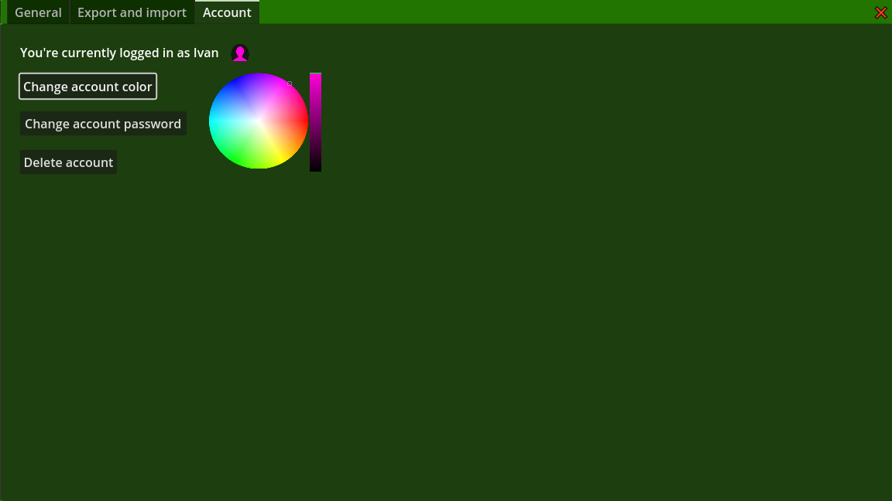

# Simple Password Manager

Simple Password Manager is a local password manager for Windows, created with Godot Engine 4.0.2. provides easy and secure local multi-user password management without a need of internet connection. 🔒
## Screenshots
- Log in screen

- Services and passwords

- User popup

- Appearance settings

- Account settings

- No side panel mode

- Password search

